This is a **daily reference manual** for reading the organizational and governance structure of a Jharkhand State University under the **Jharkhand State Universities Act, 2026**.

It is inspired by the way the IEOM paper separates a university into two linked charts on pages 8-9:

1. **organizational structure** - who occupies which office;
2. **governance structure** - which bodies make, review, approve, implement, and monitor decisions.

For Jharkhand universities, this distinction is essential. The university is not only a line of officers. It is a statutory system of officers, authorities, boards, committees, financial checks, grievance bodies, appointment procedures, and the Jharkhand State University Service Commission.

<div class="note-box" markdown="1">

**Reference PDFs**

- Governance-chart model: [IEOM paper, pages 8-9]({{ '/assets/pdf/misc/ieom-dc2018-organisational-governance-structure.pdf' | relative_url }})
- Legal source: [Jharkhand State Universities Act, 2026 Gazette PDF]({{ '/assets/pdf/ref/acts/2026-Gazette-Jharkhand-University-Act.pdf' | relative_url }})

</div>

Use this manual like a desk reference:

| If you need to locate... | Go to |
|---|---|
| who the main officers are | University Officers Map |
| who controls executive administration | Headship and Executive Chain |
| which body is highest in policy decisions | Principal Authorities; Senate, Syndicate and Academic Council |
| how an academic proposal moves | Academic Decision Flow |
| which committee handles a specific operational matter | Committees, Councils, Cells and Specialized Boards |
| how recruitment and appointment flow | Appointment and Recruitment; Service Commission |
| how finance and audit move | Finance, Funds, Accounts and Audit |
| how colleges and centres connect to the university | Colleges, Centres and Extended University Structure |
| where grievances go | Student and Employee Grievance Structure |
| how Act, Statutes, Ordinances and Rules relate | Rule-Making Structure |

## Primary Statutory Anchors

Keep these links nearby while reading the maps.

| Structure | Act section |
|---|---|
| University officers | [Section 9]({{ '/jharkhand-university-act/009-officers-of-the-university/' | relative_url }}) |
| Chancellor | [Section 10]({{ '/jharkhand-university-act/010-chancellor/' | relative_url }}) |
| Vice Chancellor | [Section 12]({{ '/jharkhand-university-act/012-vice-chancellor/' | relative_url }}) |
| Pro-Vice Chancellor | [Section 13]({{ '/jharkhand-university-act/013-pro-vice-chancellor/' | relative_url }}) |
| University authorities | [Section 40]({{ '/jharkhand-university-act/040-authorities-of-the-university/' | relative_url }}) |
| Senate | [Section 41]({{ '/jharkhand-university-act/041-senate/' | relative_url }}) |
| Syndicate | [Section 42]({{ '/jharkhand-university-act/042-syndicate/' | relative_url }}) |
| Academic Council | [Section 43]({{ '/jharkhand-university-act/043-academic-council/' | relative_url }}) |
| Council, committees and cells | [Section 71]({{ '/jharkhand-university-act/071-council-committees-and-cells/' | relative_url }}) |
| Appointments | [Sections 82-86]({{ '/jharkhand-university-act/082-appointment-of-registrar-financial-advisor-controller-of-examinations/' | relative_url }}) |
| Student and employee grievances | [Sections 100-107]({{ '/jharkhand-university-act/100-student-grievance-redressal-committee/' | relative_url }}) |
| Funds, accounts and audit | [Sections 124-128]({{ '/jharkhand-university-act/124-annual-financial-statements/' | relative_url }}) |
| State University Service Commission | [Sections 142-161]({{ '/jharkhand-university-act/142-establishment-of-commission/' | relative_url }}) |

## 1. Quick Working Principle

In daily use, ask two questions:

| Question | Meaning |
|---|---|
| Who is responsible? | Find the officer, board, committee or authority. |
| Through what route does the decision move? | Find the approval, recommendation, finance, recruitment or grievance route. |

The same matter may need both answers. For example, an examination matter may involve the Controller of Examinations, Board of Examinations and Evaluation, Academic Council, Syndicate, and sometimes grievance bodies.

## 2. At-a-Glance Locator

| Matter | First place to look | Usually connects to |
|---|---|---|
| University headship | Chancellor | Senate, convocation, VC appointment |
| Day-to-day executive leadership | Vice Chancellor | Syndicate, Academic Council, Registrar |
| Records and administration | Registrar | VC, Senate, statutory records |
| Examinations | Controller of Examinations | Board of Examinations and Evaluation, Academic Council |
| Academic standards | Academic Council | Faculty, Board of Studies, Syndicate |
| Policy and final university decisions | Senate | Syndicate, Academic Council, State Government where required |
| Property, funds and administration | Syndicate | Senate, Finance and Accounts Committee |
| Recruitment | Jharkhand State University Service Commission | University requisition, State-approved roster |
| Promotion concurrence | Jharkhand State University Service Commission | University proposal |
| Finance and audit | Finance Officer, Financial Advisor, Finance and Accounts Committee | Syndicate, Senate, annual accounts |
| Student grievance | Student Grievance Redressal Committee | Admission, examination and student matters |
| Employee grievance | Employees Grievance Redressal Committee or Tribunal | Appeal, directions, compliance |
| Colleges and centres | Directors and relevant boards | Syndicate, Academic Council, affiliation and inspection process |

The maps below convert this locator into a visual reference.

### Daily Route Cards

Use these as quick working routes before going to the detailed maps.

| Daily matter | Start here | Then check | Final or higher layer |
|---|---|---|---|
| New syllabus or course revision | Department and Board of Studies | Faculty and Academic Council | Syndicate or Senate if ordinance, policy, finance or institutional approval is needed |
| Examination issue | Controller of Examinations | Board of Examinations and Evaluation | Academic Council, Syndicate or grievance body depending on issue |
| Appointment of teachers | Director HRM and vacancy roster | State Government approved roster and Commission process | University appointment on Commission recommendation |
| Promotion proposal | University and Board of Human Resource Management | Commission concurrence | Commission decision is binding where the Act provides |
| Budget or fund matter | Finance Officer and Financial Advisor | Finance and Accounts Committee, Syndicate | Senate approval, annual accounts and audit |
| Infrastructure or works | Estate and Facility unit | Buildings and Works Committee, Syndicate | Senate or State Government if property/major approval is involved |
| Student complaint | Student Grievance Redressal Committee | Relevant academic or examination body | Statutory remedy as provided |
| Employee complaint | Employees Grievance Redressal Committee | Appeal route | Employees Grievance Redressal Tribunal |
| Constituent college matter | Director Constituent Colleges | Board of Constituent Colleges, Syndicate | Senate or State Government where required |
| Affiliated college matter | Director Affiliated Colleges | Board of Affiliated Colleges, inspection and recognition process | Syndicate, Senate or State Government depending on the matter |

## 3. Structural Layers

1. **Visitor or headship layer** - Chancellor, State Government, and statutory oversight.
2. **Executive layer** - Vice Chancellor, Pro-Vice Chancellor, Registrar, Finance Officer, Controller of Examinations, Deans, Directors, Heads.
3. **Authority layer** - Senate, Syndicate, Academic Council, Faculty, Boards.
4. **Process layer** - appointments, finance, audit, student matters, grievances, affiliation, service commission.

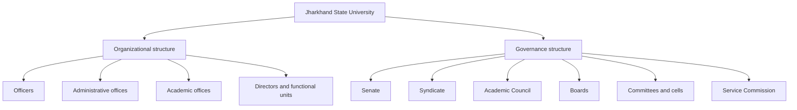

## 4. Whole Statutory Ecosystem

The university is not an isolated institution. It sits inside a statutory ecosystem involving the State Government, the Chancellor, the Department of Higher and Technical Education, the Jharkhand State University Service Commission, and the university's own authorities.

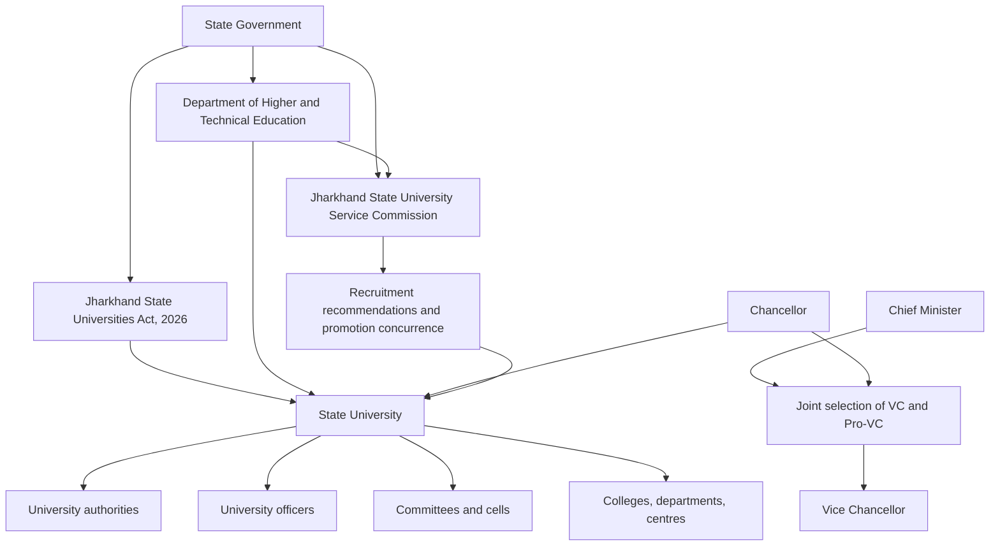

Read this map from top to bottom. The Act creates the legal frame. The State Government and Chancellor supply the outer public authority. The university then functions through its officers and internal bodies. The Service Commission is an external recruitment and promotion mechanism connected to universities through requisitions, recommendations, records, and concurrence.

## 5. University Officers Map

[Section 9]({{ '/jharkhand-university-act/009-officers-of-the-university/' | relative_url }}) gives a long list of officers. If all of them are placed in one diagram, the map becomes too dense to read on a laptop or mobile screen. So it is better to first show the **clusters**, and then open each cluster separately.

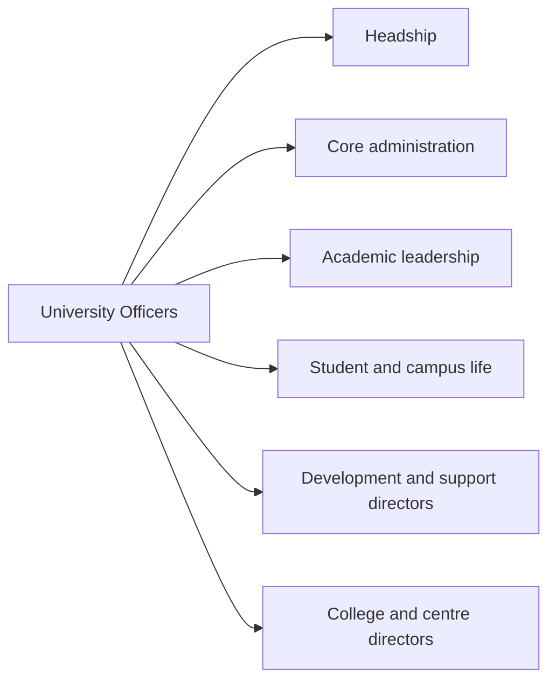

### 5.1 Headship and Core Administration

The first cluster contains the formal headship and the core administrative offices that keep the university legally and administratively functional.

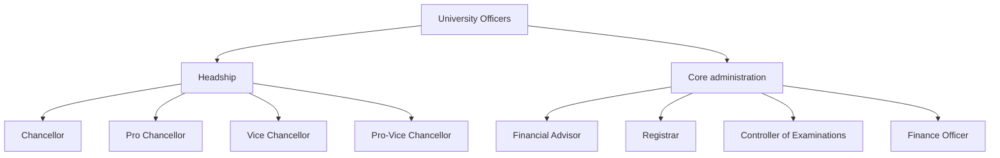

### 5.2 Academic Leadership

The second cluster is academic. It links departments, faculties, research, digital learning, knowledge resources, and lifelong learning.

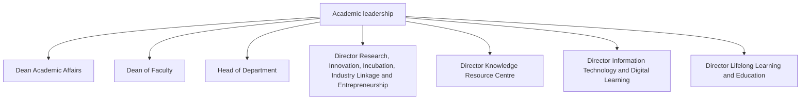

### 5.3 Student Life and Inclusion

The third cluster is student-facing. It covers discipline, student affairs, NSS, sports, culture, and inclusive education.

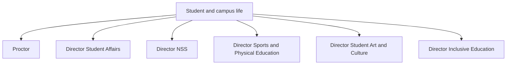

### 5.4 Development, Support, Colleges, and Centres

The last cluster contains functional directors who support the university as an institution, plus officers connected with study centres, regional centres, constituent colleges, and affiliated colleges.

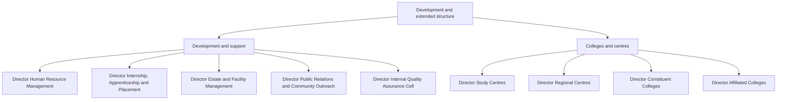

This split view is more useful than one huge chart. It shows that the officer system is not merely ceremonial. The university is expected to manage teaching, examinations, research, digital learning, student life, placements, inclusiveness, quality assurance, public relations, infrastructure, colleges, centres, and outreach.

## 6. Headship and Executive Chain

The executive chain is not a simple private-company hierarchy. The Chancellor is the head of the university. The Vice Chancellor is the chief executive officer. The Pro-Vice Chancellor works next to the Vice Chancellor and under the Vice Chancellor's superintendence, direction and control.

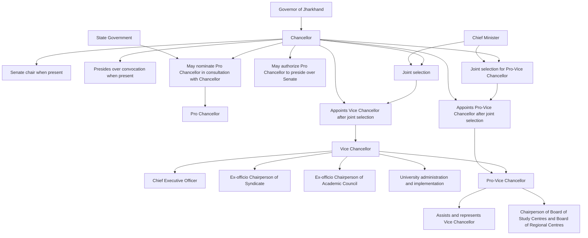

This is the central executive logic:

| Office | Core role |
|---|---|
| Chancellor | Head of the university |
| Vice Chancellor | Chief Executive Officer, chair of Syndicate and Academic Council |
| Pro-Vice Chancellor | Academic and administrative officer next to the Vice Chancellor |
| Registrar | Custodian of records and administrative officer under Vice Chancellor |
| Finance Officer and Financial Advisor | Financial administration and financial advice |
| Controller of Examinations | Examination administration |

## 7. Principal Authorities of the University

[Section 40]({{ '/jharkhand-university-act/040-authorities-of-the-university/' | relative_url }}) lists the authorities of the university. The main governing spine is:

```mermaid
flowchart TD
  AUTH["Authorities of the University"] --> SEN["Senate"]
  AUTH --> SYN["Syndicate"]
  AUTH --> AC["Academic Council"]
  AUTH --> FAC["Faculty"]
  AUTH --> BOS["Board of Studies"]
  AUTH --> EXAM["Board of Examinations and Evaluation"]
  AUTH --> SPEC["Specialized boards"]

  SEN --> SENROLE["Principal executive, final decision-making and policy-making authority"]
  SYN --> SYNROLE["Administration, property, funds, contracts, implementation under Senate guidance"]
  AC --> ACROLE["Principal academic authority"]
  FAC --> FACROLE["Faculty-level academic body"]
  BOS --> BOSROLE["Subject and curriculum-level body"]
  EXAM --> EXAMROLE["Examination and evaluation body"]

  SPEC --> RES["Research, Innovation and Incubation Board"]
  SPEC --> IT["Information Technology and Digital Learning Board"]
  SPEC --> SA["Student Affairs Board"]
  SPEC --> HR["Human Resource Management Board"]
  SPEC --> EST["Estate and Facility Management Board"]
  SPEC --> LINK["National and International Linkages Board"]
```

The Senate is the broadest policy and final decision body. The Syndicate is the working executive authority for property, funds, contracts, administration, inspection, committees, and implementation. The Academic Council is the academic quality and curriculum authority.

## 8. Senate, Syndicate, and Academic Council

The three major bodies can be read as a three-layer governance mechanism.

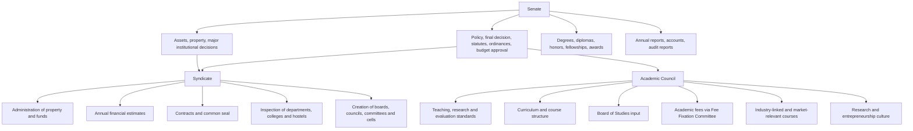

The flow is not one-way in practice. Academic proposals may originate in departments or Boards of Studies, pass through Faculty and Academic Council, and then reach Syndicate or Senate depending on the matter.

## 9. Academic Decision Flow

This is a useful way to see how an academic idea can move upward.

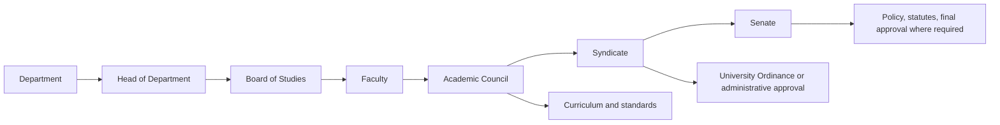

Examples:

| Matter | Likely governance path |
|---|---|
| New syllabus | Department -> Board of Studies -> Faculty -> Academic Council |
| New programme | Academic Council -> Syndicate -> Senate, depending on scale |
| New department or centre | Academic Council recommendation -> Senate decision |
| Examination reform | Board of Examinations and Evaluation -> Academic Council -> Syndicate |
| Industry-linked course | Academic Council scrutiny, with board or committee support |

## 10. Committees, Councils, and Cells

[Section 71]({{ '/jharkhand-university-act/071-council-committees-and-cells/' | relative_url }}) lists a second governance network. These bodies are more specific than Senate or Syndicate. They handle focused areas of university operation.

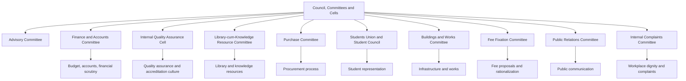

The committee system prevents every operational matter from going directly to the top. It creates smaller expert bodies that can study, recommend, screen, monitor, and report.

## 11. Specialized Boards Map

The Act creates several boards so that different university functions have dedicated homes. This is another place where one diagram can become too bulky, so the boards are grouped by function.

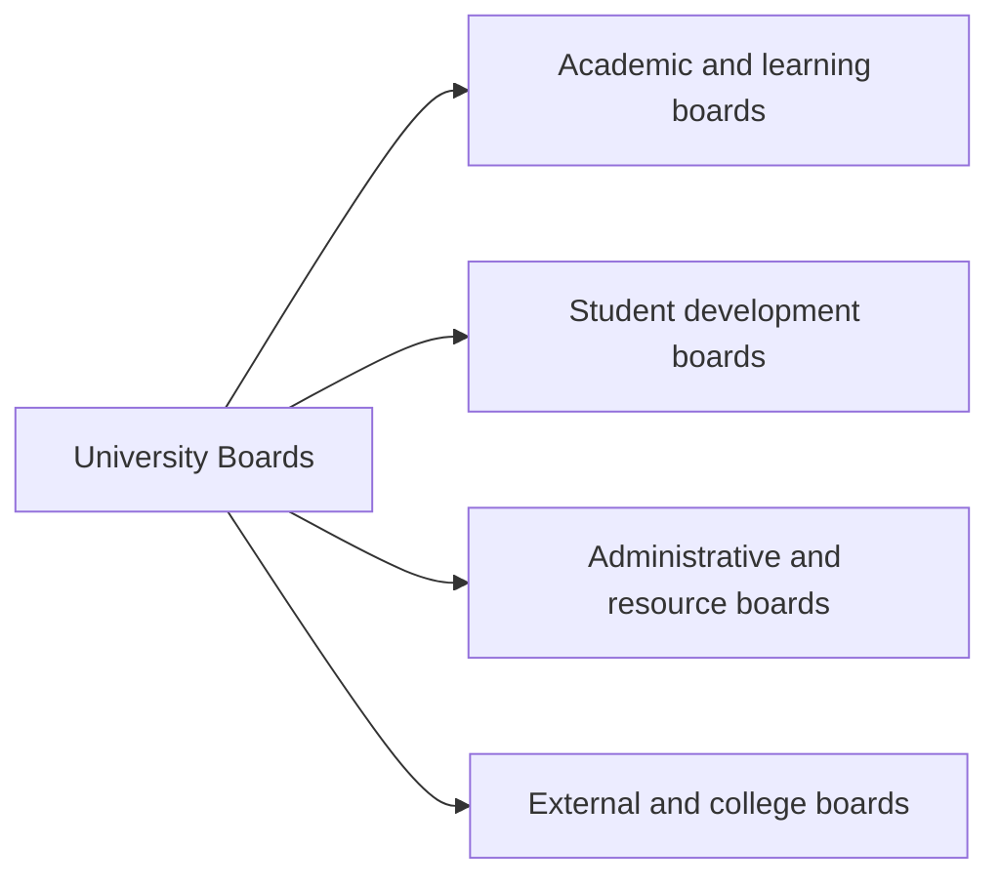

### 11.1 Academic and Learning Boards

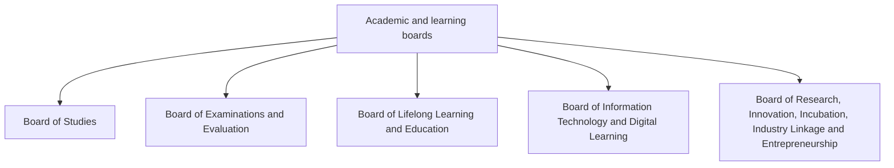

### 11.2 Student Development Boards

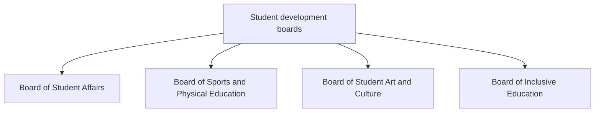

### 11.3 Administrative and Resource Boards

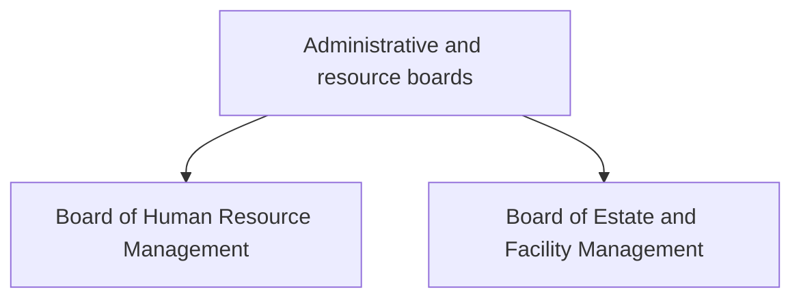

### 11.4 External, College, and Centre Boards

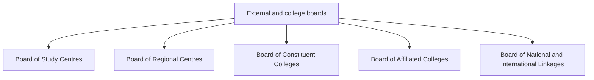

The shape of this board system tells us the Act imagines the university as a multi-function institution: academic, administrative, digital, research-oriented, inclusive, employment-linked, and outward-facing.

## 12. Appointment and Recruitment Structure

Appointments are not handled by one office alone. They involve the State Government, Chancellor, Vice Chancellor, Director of Human Resource Management, University, and the Jharkhand State University Service Commission.

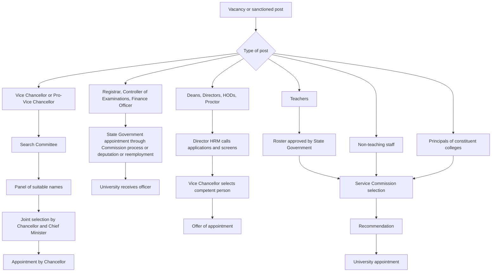

This map is important because it separates **selection**, **recommendation**, and **appointment**. The Commission recommends selected candidates for many categories, but the university or State Government performs the appointment depending on the office.

## 13. Service Commission Structure

The Jharkhand State University Service Commission is a separate statutory body. Its head office is in Ranchi, and the Department of Higher and Technical Education is the nodal administrative department.

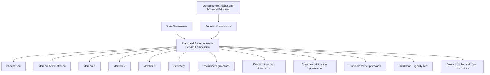

The Commission is therefore not merely an examination body. It is a recruitment, screening, recommendation, promotion-concurrence, records-seeking, and eligibility-test institution.

## 14. Recruitment Pipeline Through the Commission

[Section 150]({{ '/jharkhand-university-act/150-selection-of-officers-principals-teachers-and-non-teaching-staff-of-th/' | relative_url }}) can be mapped as a process.

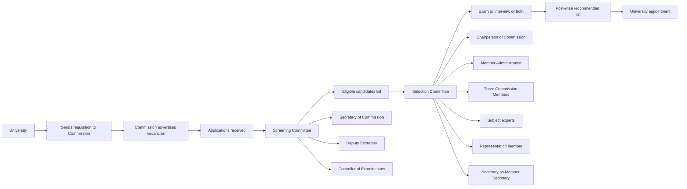

The statutory emphasis is on transparent screening, expert selection, reservation policy, and recommendation-based appointment. An appointment made contrary to the Commission's recommendation is treated as invalid under the Act's framework.

## 15. Finance, Funds, Accounts, and Audit

The financial governance structure connects the Finance Officer, Financial Advisor, Finance and Accounts Committee, Syndicate, Senate, State Government funds, university funds, and audit reports.

```mermaid
flowchart TD
  FUNDS["University finances"] --> GOVFUNDS["State Government funds"]
  FUNDS --> UNIFUNDS["University funds"]
  FUNDS --> OTHER["Funds from other agencies"]
  FUNDS --> DON["Donations, gifts and support"]

  FO["Finance Officer"] --> ACC["Accounts and finance administration"]
  FA["Financial Advisor"] --> ADVICE["Financial advice and scrutiny"]
  FACOM["Finance and Accounts Committee"] --> REVIEW["Financial review"]

  ACC --> SYN["Syndicate"]
  ADVICE --> SYN
  REVIEW --> SYN

  SYN --> BUDGET["Annual financial estimates"]
  SYN --> MANAGE["Manage funds, accounts, investments"]
  SYN --> TRANSFER["Budget transfers within permitted limits"]

  BUDGET --> SEN["Senate"]
  MANAGE --> SEN
  SEN --> APPROVE["Budget and financial decisions"]
  SEN --> AUDIT["Annual accounts and audit report"]
  AUDIT --> PUBLIC["Accountability and annual reporting"]
```

The financial structure is designed around checks. Operational finance moves through officers and committee review; larger decisions move through Syndicate and Senate; annual accounts and audit become part of institutional accountability.

## 16. Colleges, Centres, and Extended University Structure

The Act recognizes that many universities are not single-campus bodies. Some may include constituent colleges, affiliated colleges, regional centres, and study centres.

```mermaid
flowchart TD
  U["University"] --> DEPT["University Departments"]
  U --> SC["Study Centres"]
  U --> RC["Regional Centres"]
  U --> CC["Constituent Colleges"]
  U --> ACOL["Affiliated Colleges"]

  SC --> DSC["Director Study Centres"]
  RC --> DRC["Director Regional Centres"]
  CC --> DCC["Director Constituent Colleges"]
  ACOL --> DAC["Director Affiliated Colleges"]

  CC --> BCC["Board of Constituent Colleges"]
  ACOL --> BAC["Board of Affiliated Colleges"]
  SC --> BSC["Board of Study Centres"]
  RC --> BRC["Board of Regional Centres"]

  ACOL --> AFF["Affiliation and recognition conditions"]
  CC --> PRIN["Principals appointed on Commission recommendation"]
  ACOL --> INSPECT["Inspection, reports and compliance"]
```

This map is especially useful for older public universities with multiple colleges under their jurisdiction. It shows that colleges are not only academic units; they are also governance units connected to boards, inspections, appointments, affiliations, and discipline.

## 17. Student and Employee Grievance Structure

The Act includes a grievance system for students and employees.

```mermaid
flowchart TD
  GR["Grievances"] --> STU["Student grievance"]
  GR --> EMP["Employee grievance"]

  STU --> SGRC["Student Grievance Redressal Committee"]
  SGRC --> ADMISSION["Admission disputes"]
  SGRC --> EXAM["Examination and evaluation issues"]
  SGRC --> STUDMAT["Student matters"]

  EMP --> EGRC["Employees Grievance Redressal Committee"]
  EGRC --> APPEAL["Employee right of appeal"]
  APPEAL --> TRIB["Employees Grievance Redressal Tribunal"]
  TRIB --> RELIEF["Relief and directions"]
  RELIEF --> FINAL["Decision final and binding"]
  FINAL --> PENALTY["Penalty for non-compliance"]
```

This map should be read as a rights-and-remedy layer. The university governance structure is not complete unless students and employees have statutory channels for complaints, appeal, directions, and enforcement.

## 18. Rule-Making Structure: Act, Statutes, Ordinances, Rules

A university does not run only on the Act. The Act creates a hierarchy of legal instruments.

```mermaid
flowchart TD
  ACT["Act"] --> STAT["Statutes"]
  ACT --> ORD["University Ordinances"]
  ACT --> RULES["University Rules"]

  STAT --> STRUCT["Offices, authorities, service details, powers where prescribed"]
  ORD --> ACADEMIC["Academic and administrative procedures"]
  RULES --> LOCAL["Operational rules within statutory limits"]

  SEN["Senate"] --> STATREC["Recommends draft Statutes or amendment to State Government"]
  SEN --> ORDMAKE["Makes, amends or repeals University Ordinances"]
  SYN["Syndicate"] --> ORDEXEC["May make, amend and cancel Ordinances as assigned"]

  STATREC --> SG["State Government approval"]
```

This is why many sections say "as prescribed by the Statutes" or "as prescribed by the Rules". The Act gives the skeleton; statutes, ordinances, and rules give more detailed working procedures.

## 19. Quality, Accreditation, Digital Governance, and Development

The Vice Chancellor has explicit responsibilities connected to financial sustainability, examinations, accreditation, rankings, and e-governance. These responsibilities connect executive work with academic and administrative boards.

```mermaid
flowchart TD
  VC["Vice Chancellor"] --> FIN["Financial sustainability"]
  VC --> EXAM["Timely examinations and academic calendar"]
  VC --> ACCR["NAAC or NBA accreditation"]
  VC --> RANK["National and state ranking participation"]
  VC --> EGOV["E-governance implementation"]

  FIN --> FA["Financial Advisor"]
  FIN --> FO["Finance Officer"]
  FIN --> FACOM["Finance and Accounts Committee"]

  EXAM --> COE["Controller of Examinations"]
  EXAM --> BEE["Board of Examinations and Evaluation"]

  ACCR --> IQAC["Internal Quality Assurance Cell"]
  RANK --> IQAC

  EGOV --> ITDIR["Director Information Technology and Digital Learning"]
  EGOV --> ITBOARD["Board of Information Technology and Digital Learning"]
```

This map shows the difference between a legal designation and actual institutional performance. The Vice Chancellor carries high-level responsibility, but delivery needs officers, boards, cells, and committees.

## 20. Compact Governance Summary

The entire structure can be summarized like this:

```mermaid
flowchart TD
  STATE["State Government and Chancellor"] --> LEGAL["Legal authority and public oversight"]
  LEGAL --> UNIVERSITY["Jharkhand State University"]

  UNIVERSITY --> EXEC["Executive officers"]
  UNIVERSITY --> AUTHORITIES["Authorities"]
  UNIVERSITY --> COMMITTEES["Committees and cells"]
  UNIVERSITY --> COMMISSION["Service Commission connection"]
  UNIVERSITY --> COLLEGES["Departments, colleges and centres"]

  EXEC --> IMPLEMENT["Implement policy and run administration"]
  AUTHORITIES --> DECIDE["Decide policy, academics, finance and governance"]
  COMMITTEES --> SCRUTINY["Screen, review, recommend and monitor"]
  COMMISSION --> RECRUIT["Recruitment, promotion concurrence and eligibility test"]
  COLLEGES --> DELIVERY["Teaching, research, examination, outreach and student life"]

  IMPLEMENT --> ACCOUNT["Accountability"]
  DECIDE --> ACCOUNT
  SCRUTINY --> ACCOUNT
  RECRUIT --> ACCOUNT
  DELIVERY --> ACCOUNT
```

## 21. One-Line Reading

In the Jharkhand model, the university is a **statutory public institution** where:

- the **Chancellor** supplies formal headship;
- the **Vice Chancellor** supplies executive leadership;
- the **Senate** supplies final policy and decision authority;
- the **Syndicate** supplies working executive governance;
- the **Academic Council** supplies academic standards;
- the **Boards, Committees and Cells** supply specialized governance;
- the **Service Commission** supplies recruitment and promotion safeguards;
- the **State Government** remains deeply connected through approval, oversight, funding, service conditions, and statutory control.

That is the real organizational and governance structure: not one vertical chart, but a layered statutory system.
